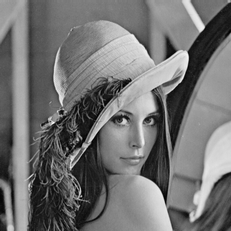
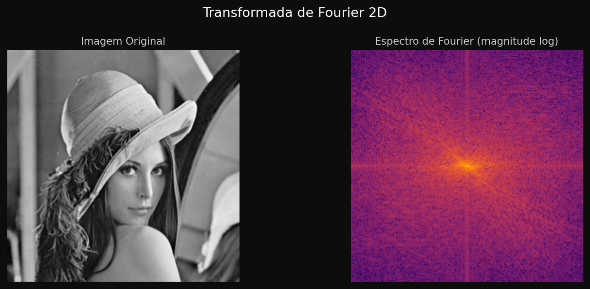
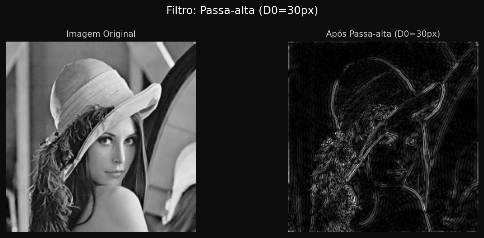
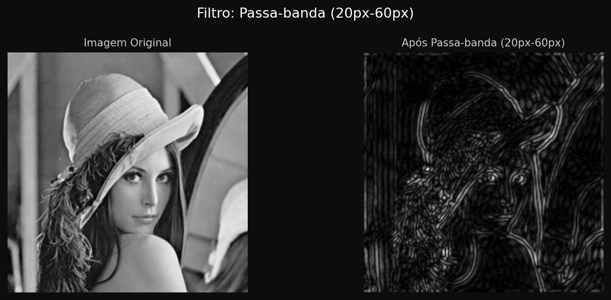
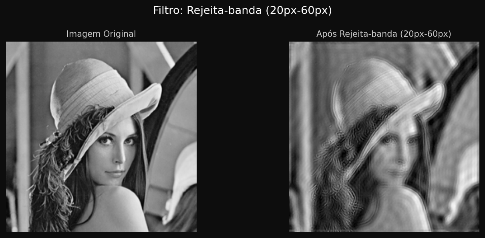

# 📷 Processamento de Imagens com Transformada de Fourier

Aplicação Python para análise e processamento de imagens utilizando a **Transformada de Fourier 2D** e filtros no domínio da frequência: passa-baixa, passa-alta, passa-banda e rejeita-banda.

---

## 📋 Sumário

- [Sobre o Projeto](#sobre-o-projeto)
- [Tecnologias Utilizadas](#tecnologias-utilizadas)
- [Estrutura de Pastas](#estrutura-de-pastas)
- [Como Rodar o Projeto](#como-rodar-o-projeto)
- [Imagem Utilizada](#imagem-utilizada)
- [Transformada de Fourier](#transformada-de-fourier)
- [Filtros Implementados](#filtros-implementados)
- [Resultados Obtidos](#resultados-obtidos)
- [Análise Comparativa dos Filtros](#análise-comparativa-dos-filtros)

---

## Sobre o Projeto

Este projeto tem como objetivo aplicar a **Transformada de Fourier 2D** em uma imagem e implementar quatro filtros diferentes no domínio da frequência, demonstrando visualmente o efeito de cada um sobre a imagem original. O projeto foi desenvolvido como atividade prática da disciplina de Processamento de Imagens.

---

## Tecnologias Utilizadas

- **Python 3.12**
- **OpenCV** (`cv2`) — carregamento e manipulação de imagens
- **NumPy** — cálculo da Transformada de Fourier e operações matriciais
- **Matplotlib** — visualização e exportação dos resultados

---

## Estrutura de Pastas

```
📁 projeto/
├── 📄 processamento_fourier_filtro.py   # Código-fonte principal
├── 📁 Imagens/
│   └── 🖼️ lena.png                      # Imagem utilizada nos testes
├── 📁 resultados/
│   ├── 🖼️ transformada_fourier.png       # Espectro de Fourier
│   ├── 🖼️ resultado_passabaixa.png       # Resultado do filtro passa-baixa
│   ├── 🖼️ resultado_passaalta.png        # Resultado do filtro passa-alta
│   ├── 🖼️ resultado_passabanda.png       # Resultado do filtro passa-banda
│   └── 🖼️ resultado_rejeitabanda.png     # Resultado do filtro rejeita-banda
├── 📄 README.md
└── 📄 .gitignore
```

---

## Como Rodar o Projeto

### Pré-requisitos

- Python 3.12 instalado — [python.org/downloads](https://www.python.org/downloads)
- Durante a instalação do Python, marcar a opção **"Add Python to PATH"**

### Instalação das dependências

Abra o terminal na pasta do projeto e execute:

```bash
pip install opencv-python numpy matplotlib
```

### Executando o projeto

```bash
python processamento_fourier_filtro.py
```

Ao rodar, serão exibidas **5 janelas** na seguinte ordem:

1. Transformada de Fourier 2D (imagem original + espectro)
2. Filtro Passa-baixa
3. Filtro Passa-alta
4. Filtro Passa-banda
5. Filtro Rejeita-banda

Os resultados são salvos automaticamente na pasta `resultados/`.

### Trocando a imagem

Para usar outra imagem, altere esta linha no `main()`:

```python
img_path = "Imagens/lena.png"  # ← troque pelo caminho da sua imagem
```

---

## Imagem Utilizada

A imagem utilizada foi a clássica **Lena** (512×512 pixels), amplamente adotada como padrão acadêmico mundial em processamento de imagens por conter uma boa variedade de detalhes: bordas nítidas, regiões uniformes, texturas e gradientes suaves — características ideais para demonstrar o efeito de diferentes filtros.



---

## Transformada de Fourier

### O que é o Espectro de Fourier?

A **Transformada de Fourier 2D** converte uma imagem do domínio espacial (pixels) para o **domínio da frequência**, decompondo a imagem em suas componentes de frequência.

No espectro gerado:

- O **centro** da imagem representa as **baixas frequências** — responsáveis pelas variações suaves de intensidade, como gradientes e áreas uniformes (fundo, regiões lisas do rosto).
- As **bordas** do espectro representam as **altas frequências** — responsáveis pelos detalhes finos, bordas abruptas e ruídos.
- O **ponto mais brilhante no centro** é a componente DC (frequência zero), que representa o brilho médio da imagem.
- A **escala logarítmica** é aplicada na visualização para que componentes de baixa amplitude também fiquem visíveis.

No código, isso é implementado com:

```python
dft = np.fft.fft2(img_float)       # Aplica a DFT 2D
dft_shift = np.fft.fftshift(dft)   # Centraliza o espectro
magnitude = 20 * np.log(np.abs(dft_shift) + 1)  # Escala log
```

---

## Filtros Implementados

Todos os filtros são implementados como **máscaras circulares** aplicadas diretamente sobre o espectro de Fourier. Após a filtragem, a **Transformada Inversa** (`np.fft.ifft2`) reconstrói a imagem no domínio espacial.

---

### 1. 🔵 Filtro Passa-baixa (`lowpass_filter`)

**Parâmetro:** raio de corte D₀ = 30px

**O que faz:** Mantém apenas as frequências baixas (centro do espectro) e elimina as frequências altas (bordas do espectro).

**Máscara:** Disco branco no centro — valor 1 dentro do raio, 0 fora.

**Impacto visual:** A imagem fica **suavizada/borrada**. Detalhes finos e bordas nítidas são perdidos, pois estão associados às altas frequências removidas. Quanto menor o raio de corte, mais intensa é a suavização.

**Frequências removidas:** Todas acima de 30px de distância do centro do espectro.

**Frequências preservadas:** Estruturas globais, gradientes suaves, variações lentas de intensidade.

---

### 2. 🔴 Filtro Passa-alta (`highpass_filter`)

**Parâmetro:** raio de corte D₀ = 30px

**O que faz:** Remove as frequências baixas (centro do espectro) e mantém apenas as frequências altas.

**Máscara:** Disco preto no centro — valor 0 dentro do raio, 1 fora. É o inverso exato do passa-baixa.

**Impacto visual:** A imagem resultante fica **escura**, com destaque apenas para **bordas e contornos**. As regiões uniformes (como o fundo e áreas lisas) desaparecem pois são compostas de baixas frequências. Podem aparecer artefatos de Gibbs (anéis ao redor das bordas), que são ondulações causadas pelo corte abrupto ideal do filtro.

**Frequências removidas:** Todas abaixo de 30px de distância do centro (componente DC e baixas frequências).

**Frequências preservadas:** Bordas, detalhes finos, transições abruptas de intensidade.

---

### 3. 🟡 Filtro Passa-banda (`bandpass_filter`)

**Parâmetros:** limite inferior 20px, limite superior 60px

**O que faz:** Mantém apenas as frequências dentro de uma faixa específica, eliminando tanto as muito baixas quanto as muito altas.

**Máscara:** Anel (coroa circular) — valor 1 entre os raios 20px e 60px, 0 fora dessa faixa.

**Impacto visual:** A imagem resultante exibe **padrões e texturas de frequência intermediária**. As estruturas globais (baixas frequências) e os detalhes muito finos (altas frequências) são removidos, sobrando apenas os elementos de escala média. Na imagem da Lena, isso realça padrões como a textura do cabelo e o contorno do chapéu de forma isolada.

**Frequências removidas:** Abaixo de 20px (estruturas globais) e acima de 60px (detalhes finos e ruído).

**Frequências preservadas:** Apenas a faixa entre 20px e 60px — texturas e bordas de escala intermediária.

---

### 4. 🟢 Filtro Rejeita-banda (`bandreject_filter`)

**Parâmetros:** limite inferior 20px, limite superior 60px

**O que faz:** Remove uma faixa específica de frequências, mantendo tudo fora dela. É o complemento exato do passa-banda.

**Máscara:** Inverso do passa-banda — valor 0 entre 20px e 60px, 1 fora.

**Impacto visual:** A imagem mantém a aparência geral (estruturas globais preservadas), mas **perde as texturas e bordas de frequência intermediária**. O resultado é uma imagem que parece uma combinação do passa-baixa com o passa-alta extremo. É muito eficiente para eliminar **ruídos periódicos** de frequência específica, como listras ou interferências de varredura.

**Frequências removidas:** A faixa entre 20px e 60px.

**Frequências preservadas:** As componentes DC e baixas frequências (abaixo de 20px) e as altas frequências (acima de 60px).

---

## Resultados Obtidos

| Filtro | Resultado |
|---|---|
| Transformada de Fourier |  |
| Passa-baixa |  |
| Passa-alta |  |
| Passa-banda |  |
| Rejeita-banda |  |

---

## Análise Comparativa dos Filtros

### Comparação entre os filtros

| Filtro | Frequências mantidas | Efeito visual | Uso típico |
|---|---|---|---|
| **Passa-baixa** | Baixas | Suavização / desfoque | Redução de ruído |
| **Passa-alta** | Altas | Realce de bordas | Detecção de contornos |
| **Passa-banda** | Intermediárias | Isolamento de texturas | Análise de padrões |
| **Rejeita-banda** | Baixas + Altas | Remove faixa específica | Eliminação de ruído periódico |

### Qual filtro produziu o melhor resultado?

Para a imagem da Lena, o **filtro passa-baixa** produziu o resultado visualmente mais equilibrado e interpretável. Embora cause suavização, a imagem reconstruída ainda é reconhecível e mantém as estruturas principais do rosto e do chapéu.

O **filtro passa-alta**, produz um resultado de difícil interpretação, pois a imagem fica quase completamente escura. O **passa-banda** e o **rejeita-banda** têm resultados intermediários e são mais úteis em contextos específicos de análise de frequências do que para visualização geral.

---
